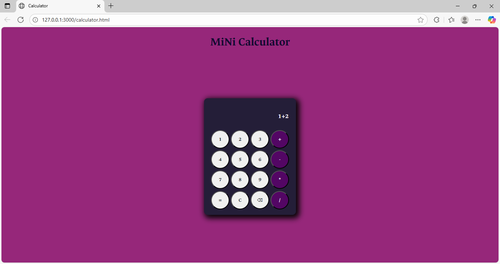
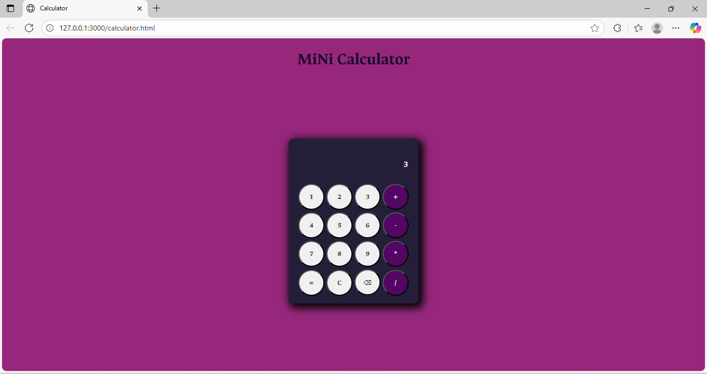

# 🧮 Mini Calculator

A simple web-based calculator built using **HTML**, **CSS**, and **JavaScript**.  
I made this project to learn and practice **Git** and **GitHub** operations — things like committing, branching, merging, and pushing code to a remote repository.

## 🚀 Features
- Basic arithmetic operations (+, −, ×, ÷)  
- Responsive button design  
- Hover effects for interactivity  
- Minimalist dark theme with a gradient background  

## 💻 Tech Stack
- **HTML** – Structure  
- **CSS** – Styling and layout  
- **JavaScript** – Functionality  

## 🧠 Purpose
- This repo was created for my understanding of **Git** and **GitHub**.  
- Helps me practice version control workflows like staging, committing, pushing, and managing repositories.  
- I used this project as an example for executing some basic git commands and to understand it's workflow

